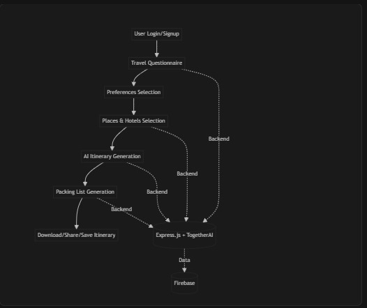
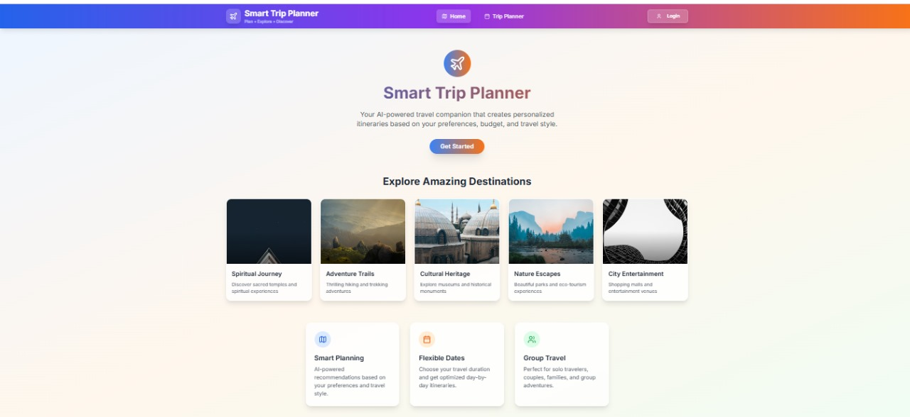
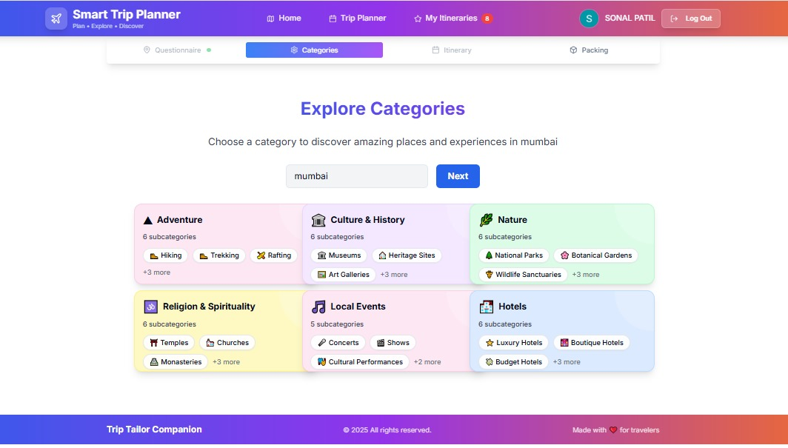
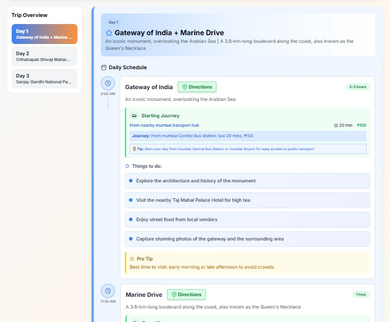
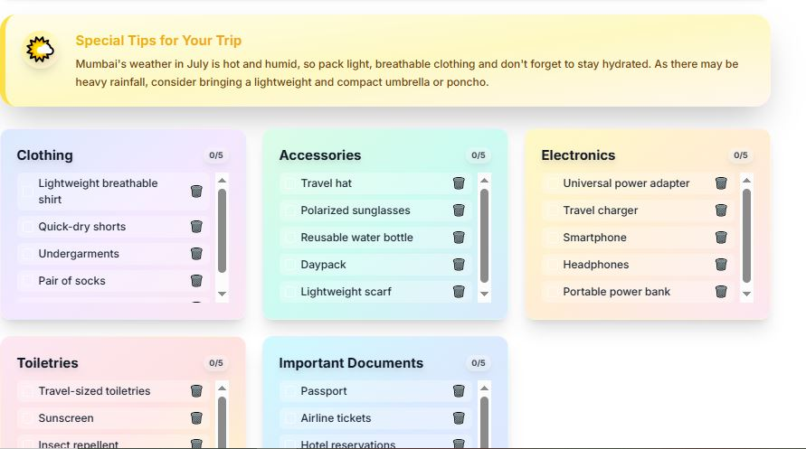
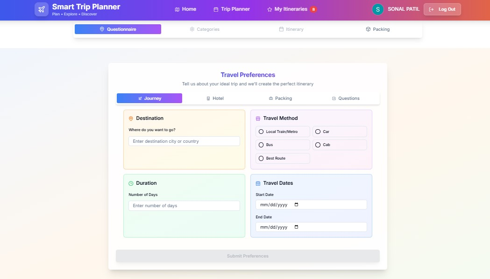

# Trip Tailor Companion

AI-Powered Travel Planner

---

## Project Description
Trip Tailor Companion (TravelGenie) is an AI-powered web application that helps users create personalized travel itineraries based on their preferences, budget, and travel style. The app provides smart recommendations for destinations, places, hotels, and activities, and generates optimized packing lists for every trip.

---

## Technology Stack
- **Frontend:** React, TypeScript, Vite, TailwindCSS, shadcn/ui, Lucide Icons
- **Backend:** Express.js, TogetherAI API
- **Database & Auth:** Firebase (Firestore, Auth, Analytics)
- **Other:** React Router, React Query, OpenAI/TogetherAI, Radix UI, Recharts

---

## Features Implemented
- User authentication (Firebase Auth)
- AI-powered travel questionnaire
- Smart destination, place, and hotel recommendations
- Flexible date and group travel planning
- Day-by-day itinerary generation
- Packing list generation using AI with weather suggestion
- Save, download, and share itineraries
- Responsive, modern UI with beautiful gradients and cards

---

## Setup & Installation
1. **Clone the repository:**
   ```bash
   git clone <your-repo-url>
   cd trip-tailor-companion
   ```
2. **Install dependencies:**
   ```bash
   npm install
   ```
3. **Set up environment variables:**
   - Create a `.env` file and add your TogetherAI API key and Firebase config.
4. **Run the development server:**
   ```bash
   npm run dev
   ```
5. **Build for production:**
   ```bash
   npm run build
   ```

---

## Link to Deployed Application
> [Add your deployment link here]

---

## App Flow / System Architecture



---

## Screenshots
| Home Page | Category Selection | Itinerary | Packing | Questionnaire |
|-----------|-------------------|-----------|---------|---------------|
|  |  |  |  |  |

---

## Team Members & Contributions
- **Sonal Patil** – Frontend (UI/UX, React, Tailwind, shadcn/ui)
- **Pradnya Patil** – Backend (Express.js, API integration, Firebase)

---

## Future Roadmap / Improvements
- Add user profile and trip history
- Integrate more travel APIs for real-time data
- Enable collaborative/group trip planning
- Add payment and booking integration
- Improve AI recommendations with user feedback
- Mobile app version

---

## Example
Inspired by: [https://github.com/username/project-name](https://github.com/sonal-030106/trip-tailor-companion.git)
